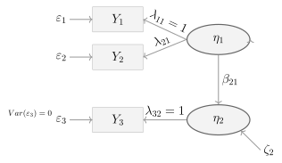


 
## Pfaddiagramm 

{width=700}

## Regressionsgleichungen (manifest)

SPOILER!

$$
\begin{aligned}
Y_1 &= \lambda_{11}\eta_1 + \varepsilon_1 = \eta_1 + \varepsilon_1 \\
Y_2 &= \lambda_{21}\eta_1 + \varepsilon_2 \\
Y_3 &= \lambda_{32}\eta_2 + \varepsilon_3 = \eta_2 + \varepsilon_3
\end{aligned}
$$

Kommentar: Da $\lambda_{11}=1$ und $\lambda_{32}=1$, sind $Y_1$ und $Y_3$ direkt als Summe von latenter Variable und Residuum darstellbar.

---

## Regressionsgleichungen (latent)

SPOILER!

$$
\eta_2 = \beta_{21}\eta_1 + \zeta_2
$$

Einsetzen in $Y_3$:

$$
Y_3 = \eta_2 + \varepsilon_3 = \beta_{21}\eta_1 + \zeta_2 + \varepsilon_3
$$

---

## Varianzen

SPOILER!

$$
\mathrm{Var}(Y_1) = \mathrm{Var}(\eta_1 + \varepsilon_1) = \mathrm{Var}(\eta_1) + \mathrm{Var}(\varepsilon_1) + 2\mathrm{Cov}(\eta_1,\varepsilon_1)
$$

Kommentar: Nach Annahme $\mathrm{Cov}(\eta_1,\varepsilon_1)=0$ (Residuum unkorreliert mit latenter Variablen) ergibt sich:

$$
\mathrm{Var}(Y_1) = \mathrm{Var}(\eta_1) + \mathrm{Var}(\varepsilon_1)
$$

---

$$
\mathrm{Var}(Y_2) = \mathrm{Var}(\lambda_{21}\eta_1 + \varepsilon_2) = \lambda_{21}^2 \,\mathrm{Var}(\eta_1) + \mathrm{Var}(\varepsilon_2)
$$

---

$$
\mathrm{Var}(Y_3) = \mathrm{Var}(\beta_{21}\eta_1 + \zeta_2 + \varepsilon_3)
$$

Da $\mathrm{Var}(\varepsilon_3)=0$, bleibt:

$$
\mathrm{Var}(Y_3) = \mathrm{Var}(\beta_{21}\eta_1 + \zeta_2) = \beta_{21}^2\mathrm{Var}(\eta_1) + \mathrm{Var}(\zeta_2)
$$

---

## Kovarianzen

SPOILER!

$\mathrm{Cov}(Y_1,Y_2)$

$$
\begin{aligned}
\mathrm{Cov}(Y_1,Y_2) &= \mathrm{Cov}(\eta_1 + \varepsilon_1,\; \lambda_{21}\eta_1 + \varepsilon_2) \\
&= \lambda_{21}\mathrm{Cov}(\eta_1,\eta_1) + \mathrm{Cov}(\eta_1,\varepsilon_2) + \lambda_{21}\mathrm{Cov}(\varepsilon_1,\eta_1) + \mathrm{Cov}(\varepsilon_1,\varepsilon_2)
\end{aligned}
$$

Nach den Annahmen ($\mathrm{Cov}(\varepsilon_i,\varepsilon_j)=0$ für $i\neq j$, Residuen unkorreliert mit latenten Variablen):

$$
\mathrm{Cov}(Y_1,Y_2) = \lambda_{21}\mathrm{Var}(\eta_1)
$$

---

$mathrm{Cov}(Y_1,Y_3)$

$$
\begin{aligned}
\mathrm{Cov}(Y_1,Y_3) &= \mathrm{Cov}(\eta_1+\varepsilon_1,\; \beta_{21}\eta_1+\zeta_2+\varepsilon_3) \\
&= \beta_{21}\mathrm{Cov}(\eta_1,\eta_1)+\mathrm{Cov}(\eta_1,\zeta_2)+\mathrm{Cov}(\eta_1,\varepsilon_3)+\beta_{21}\mathrm{Cov}(\varepsilon_1,\eta_1)+\mathrm{Cov}(\varepsilon_1,\zeta_2)+\mathrm{Cov}(\varepsilon_1,\varepsilon_3)
\end{aligned}
$$

Nach den Annahmen bleiben nur:

$$
\mathrm{Cov}(Y_1,Y_3) = \beta_{21}\mathrm{Var}(\eta_1)
$$

---

$\mathrm{Cov}(Y_2,Y_3)$

$$
\begin{aligned}
\mathrm{Cov}(Y_2,Y_3) &= \mathrm{Cov}(\lambda_{21}\eta_1+\varepsilon_2,\; \beta_{21}\eta_1+\zeta_2+\varepsilon_3) \\
&= \lambda_{21}\beta_{21}\mathrm{Cov}(\eta_1,\eta_1)+\lambda_{21}\mathrm{Cov}(\eta_1,\zeta_2)+\lambda_{21}\mathrm{Cov}(\eta_1,\varepsilon_3)+\beta_{21}\mathrm{Cov}(\varepsilon_2,\eta_1)+\mathrm{Cov}(\varepsilon_2,\zeta_2)+\mathrm{Cov}(\varepsilon_2,\varepsilon_3)
\end{aligned}
$$

Nach den Annahmen:

$$
\mathrm{Cov}(Y_2,Y_3) = \lambda_{21}\beta_{21}\mathrm{Var}(\eta_1)
$$
 

(Nachvollziehen der Matrizenform auf der Folie)

**Messmodell**
 
$$
\underset{(3 \times 1)}{\mathbf{y}} = \underset{(3 \times 2)}{\boldsymbol{\Lambda}} \;\underset{(2 \times 1)}{\boldsymbol{\eta}} + \underset{(3 \times 1)}{\boldsymbol{\varepsilon}}
$$
 
mit
 
$$
\begin{pmatrix} Y_1 \\ Y_2 \\ Y_3 \end{pmatrix}
=
\begin{pmatrix} 1 & 0 \\ \lambda_{21} & 0 \\ 0 & 1 \end{pmatrix}
\begin{pmatrix} \eta_1 \\ \eta_2 \end{pmatrix}
+
\begin{pmatrix} \varepsilon_1 \\ \varepsilon_2 \\ \varepsilon_3 \end{pmatrix}
$$
 
**Strukturmodell**
 
$$
\underset{(2 \times 1)}{\boldsymbol{\eta}} = \underset{(2 \times 2)}{\mathbf{B}}\;\underset{(2 \times 1)}{\boldsymbol{\eta}} + \underset{(2 \times 1)}{\boldsymbol{\zeta}}
$$
 
mit
 
$$
\begin{pmatrix} \eta_1 \\ \eta_2 \end{pmatrix}
=
\begin{pmatrix} 0 & 0 \\ \beta_{21} & 0 \end{pmatrix}
\begin{pmatrix} \eta_1 \\ \eta_2 \end{pmatrix}
+
\begin{pmatrix} \zeta_1 \\ \zeta_2 \end{pmatrix}
$$
 
Kommentar: $\eta_1$ ist exogen (erste Zeile von $\mathbf{B}$ ist null), d.h. $\zeta_1 \equiv \eta_1$.
 
**Parametermatrizen**
 
Kovarianzmatrix der latenten Residuen:

$$
\boldsymbol{\Psi} = \mathrm{Cov}(\boldsymbol{\zeta}) =
\begin{pmatrix} \psi_{11} & 0 \\ 0 & \psi_{22} \end{pmatrix}
$$
 
mit $\psi_{11} = \mathrm{Var}(\eta_1)$ und $\psi_{22} = \mathrm{Var}(\zeta_2)$.
 
Kovarianzmatrix der Messmodell-Residuen:
 
$$
\boldsymbol{\Theta} = \mathrm{Cov}(\boldsymbol{\varepsilon}) =
\begin{pmatrix} \theta_{1} & 0 & 0 \\ 0 & \theta_{2} & 0 \\ 0 & 0 & 0 \end{pmatrix}
$$
 
mit der Restriktion $\mathrm{Var}(\varepsilon_3) = 0$.
 
**Modellimplizierte Kovarianzmatrix**
 
$$
\boldsymbol{\Sigma} = \boldsymbol{\Lambda}\,(\mathbf{I}-\mathbf{B})^{-1}\,\boldsymbol{\Psi}\,\left[(\mathbf{I}-\mathbf{B})^{-1}\right]^\top \boldsymbol{\Lambda}^\top + \boldsymbol{\Theta}
$$
 
Herleitung in einzelnen Schritten:
 
$$
(\mathbf{I}-\mathbf{B})^{-1}
=
\begin{pmatrix} 1 & 0 \\ -\beta_{21} & 1 \end{pmatrix}^{-1}
=
\begin{pmatrix} 1 & 0 \\ \beta_{21} & 1 \end{pmatrix}
$$
 
Daraus ergibt sich die Kovarianzmatrix der latenten Variablen:
 
$$
(\mathbf{I}-\mathbf{B})^{-1}\,\boldsymbol{\Psi}\,\left[(\mathbf{I}-\mathbf{B})^{-1}\right]^\top
=
\begin{pmatrix} \psi_{11} & \beta_{21}\psi_{11} \\ \beta_{21}\psi_{11} & \beta_{21}^2\psi_{11}+\psi_{22} \end{pmatrix}
$$
 
Und schließlich:
 
$$
\boldsymbol{\Sigma}
=
\begin{pmatrix}
\psi_{11} + \theta_{1}  &  \lambda_{21}\psi_{11}  &  \beta_{21}\psi_{11} \\
\lambda_{21}\psi_{11}  &  \lambda_{21}^2\psi_{11} + \theta_{2}  &  \lambda_{21}\beta_{21}\psi_{11} \\
\beta_{21}\psi_{11}  &  \lambda_{21}\beta_{21}\psi_{11}  &  \beta_{21}^2\psi_{11} + \psi_{22}
\end{pmatrix}
$$
 
Kommentar: 

* Das Modell hat **6 freie Parameter** ($\lambda_{21}$, $\beta_{21}$, $\psi_{11}$, $\psi_{22}$, $\theta_1$, $\theta_2$) bei 6 nicht-redundanten Elementen in $\boldsymbol{\Sigma}$ (3 Varianzen + 3 Kovarianzen = 6 = 3 * 4 / 2), d.h. das Modell hat $df = 6 - 6 = 0$ Freiheitsgrade und ist **gerade identifiziert** (*just identified*).
 

