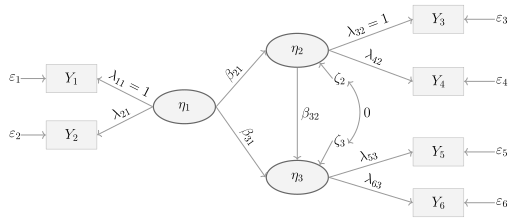


 
## Pfaddiagramm 

{width=700}
 
## Regressionsgleichungen (manifest und latent)

SPOILER!

$$
\begin{aligned}
Y_1 &= \lambda_{11}\eta_1 + \varepsilon_1 = \eta_1 + \varepsilon_1 \quad (\lambda_{11}=1)\\
Y_2 &= \lambda_{21}\eta_1 + \varepsilon_2\\
\eta_2 &= \beta_{21}\eta_1 + \zeta_2 = \eta_1 + \zeta_2 \quad (\beta_{21}=1)\\
Y_3 &= \lambda_{32}\eta_2 + \varepsilon_3 = \eta_2 + \varepsilon_3 \quad (\lambda_{32}=1)\\
     &= \eta_1 + \zeta_2 + \varepsilon_3\\
Y_4 &= \lambda_{42}\eta_2 + \varepsilon_4 = \eta_2 + \varepsilon_4 \quad (\lambda_{42}=1)\\
     &= \eta_1 + \zeta_2 + \varepsilon_4\\
\eta_3 &= \beta_{31}\eta_1 + \beta_{32}\eta_2 + \zeta_3\\
       &= \beta_{31}\eta_1 + \beta_{32}(\eta_1+\zeta_2) + \zeta_3\\
       &= (\beta_{31}+\beta_{32})\eta_1 + \beta_{32}\zeta_2 + \zeta_3\\
Y_5 &= \lambda_{53}\eta_3 + \varepsilon_5 = \eta_3 + \varepsilon_5 \quad (\lambda_{53}=1)\\
     &= (\beta_{31}+\beta_{32})\eta_1 + \beta_{32}\zeta_2 + \zeta_3 + \varepsilon_5\\
Y_6 &= \lambda_{63}\eta_3 + \varepsilon_6\\
    &= \lambda_{63}\left[(\beta_{31}+\beta_{32})\eta_1 + \beta_{32}\zeta_2 + \zeta_3\right]+\varepsilon_6\\
    &= \lambda_{63}(\beta_{31}+\beta_{32})\eta_1 + \lambda_{63}\beta_{32}\zeta_2 + \lambda_{63}\zeta_3 + \varepsilon_6
\end{aligned}
$$

---

## Varianzen

SPOILER!

$$
\mathrm{Var}(Y_1)=\mathrm{Var}(\eta_1)+\mathrm{Var}(\varepsilon_1)
$$
$$
\mathrm{Var}(Y_2)=\lambda_{21}^2\mathrm{Var}(\eta_1)+\mathrm{Var}(\varepsilon_2)
$$
$$
\mathrm{Var}(Y_3)=\mathrm{Var}(\eta_1+\zeta_2+\varepsilon_3)=\mathrm{Var}(\eta_1)+\mathrm{Var}(\zeta_2)+\mathrm{Var}(\varepsilon_3)
$$
$$
\mathrm{Var}(Y_4)=\mathrm{Var}(\eta_1+\zeta_2+\varepsilon_4)=\mathrm{Var}(\eta_1)+\mathrm{Var}(\zeta_2)+\mathrm{Var}(\varepsilon_4)
$$
$$
\begin{aligned}
\mathrm{Var}(Y_5) &= \mathrm{Var}\bigl((\beta_{31}+\beta_{32})\eta_1+\beta_{32}\zeta_2+\zeta_3+\varepsilon_5\bigr)\\
&= (\beta_{31}+\beta_{32})^2\mathrm{Var}(\eta_1)+\beta_{32}^2\mathrm{Var}(\zeta_2)+\mathrm{Var}(\zeta_3)+\mathrm{Var}(\varepsilon_5)
\end{aligned}
$$
$$
\begin{aligned}
\mathrm{Var}(Y_6) &= \mathrm{Var}\bigl(\lambda_{63}(\beta_{31}+\beta_{32})\eta_1+\lambda_{63}\beta_{32}\zeta_2+\lambda_{63}\zeta_3+\varepsilon_6\bigr)\\
&= \lambda_{63}^2(\beta_{31}+\beta_{32})^2\mathrm{Var}(\eta_1)+\lambda_{63}^2\beta_{32}^2\mathrm{Var}(\zeta_2)+\lambda_{63}^2\mathrm{Var}(\zeta_3)+\mathrm{Var}(\varepsilon_6)
\end{aligned}
$$

---

## Kovarianzen

SPOILER!

### Zwischen $Y_1$ und anderen Variablen

$$
\begin{aligned}
\mathrm{Cov}(Y_1,Y_2)&=\mathrm{Cov}(\eta_1+\varepsilon_1,\;\lambda_{21}\eta_1+\varepsilon_2)=\lambda_{21}\mathrm{Var}(\eta_1)\\
\mathrm{Cov}(Y_1,Y_3)&=\mathrm{Cov}(\eta_1+\varepsilon_1,\;\eta_1+\zeta_2+\varepsilon_3)=\mathrm{Var}(\eta_1)\\
\mathrm{Cov}(Y_1,Y_4)&=\mathrm{Cov}(\eta_1+\varepsilon_1,\;\eta_1+\zeta_2+\varepsilon_4)=\mathrm{Var}(\eta_1)\\
\mathrm{Cov}(Y_1,Y_5)&=\mathrm{Cov}\bigl(\eta_1+\varepsilon_1,\;(\beta_{31}+\beta_{32})\eta_1+\beta_{32}\zeta_2+\zeta_3+\varepsilon_5\bigr)\\
&=(\beta_{31}+\beta_{32})\mathrm{Var}(\eta_1)\\
\mathrm{Cov}(Y_1,Y_6)&=\mathrm{Cov}\bigl(\eta_1+\varepsilon_1,\;\lambda_{63}(\beta_{31}+\beta_{32})\eta_1+\lambda_{63}\beta_{32}\zeta_2+\lambda_{63}\zeta_3+\varepsilon_6\bigr)\\
&=\lambda_{63}(\beta_{31}+\beta_{32})\mathrm{Var}(\eta_1)
\end{aligned}
$$

### Zwischen $Y_2$ und anderen Variablen

$$
\begin{aligned}
\mathrm{Cov}(Y_2,Y_3)&=\mathrm{Cov}(\lambda_{21}\eta_1+\varepsilon_2,\;\eta_1+\zeta_2+\varepsilon_3)=\lambda_{21}\mathrm{Var}(\eta_1)\\
\mathrm{Cov}(Y_2,Y_4)&=\lambda_{21}\mathrm{Var}(\eta_1)\\
\mathrm{Cov}(Y_2,Y_5)&=\lambda_{21}(\beta_{31}+\beta_{32})\mathrm{Var}(\eta_1)\\
\mathrm{Cov}(Y_2,Y_6)&=\lambda_{21}\lambda_{63}(\beta_{31}+\beta_{32})\mathrm{Var}(\eta_1)
\end{aligned}
$$

### Zwischen $Y_3$ und anderen Variablen

$$
\begin{aligned}
\mathrm{Cov}(Y_3,Y_4)&=\mathrm{Cov}(\eta_1+\zeta_2+\varepsilon_3,\;\eta_1+\zeta_2+\varepsilon_4)=\mathrm{Var}(\eta_1)+\mathrm{Var}(\zeta_2)\\
\mathrm{Cov}(Y_3,Y_5)&=\mathrm{Cov}\bigl(\eta_1+\zeta_2+\varepsilon_3,\;(\beta_{31}+\beta_{32})\eta_1+\beta_{32}\zeta_2+\zeta_3+\varepsilon_5\bigr)\\
&=(\beta_{31}+\beta_{32})\mathrm{Var}(\eta_1)+\beta_{32}\mathrm{Var}(\zeta_2)\\
\mathrm{Cov}(Y_3,Y_6)&=\lambda_{63}\bigl[(\beta_{31}+\beta_{32})\mathrm{Var}(\eta_1)+\beta_{32}\mathrm{Var}(\zeta_2)\bigr]
\end{aligned}
$$

### Zwischen $Y_4$ und anderen Variablen

$$
\begin{aligned}
\mathrm{Cov}(Y_4,Y_5)&=(\beta_{31}+\beta_{32})\mathrm{Var}(\eta_1)+\beta_{32}\mathrm{Var}(\zeta_2)\\
\mathrm{Cov}(Y_4,Y_6)&=\lambda_{63}\bigl[(\beta_{31}+\beta_{32})\mathrm{Var}(\eta_1)+\beta_{32}\mathrm{Var}(\zeta_2)\bigr]
\end{aligned}
$$

### Zwischen $Y_5$ und $Y_6$

$$
\begin{aligned}
\mathrm{Cov}(Y_5,Y_6)&=\lambda_{63}\bigl[(\beta_{31}+\beta_{32})^2\mathrm{Var}(\eta_1)+\beta_{32}^2\mathrm{Var}(\zeta_2)+\mathrm{Var}(\zeta_3)\bigr]
\end{aligned}
$$
 

 
---

## Kompakte Matrizenform

SPOILER!

 
### Messmodell
 
$$
\underset{(6 \times 1)}{\mathbf{y}} = \underset{(6 \times 3)}{\boldsymbol{\Lambda}} \;\underset{(3 \times 1)}{\boldsymbol{\eta}} + \underset{(6 \times 1)}{\boldsymbol{\varepsilon}}
$$
 
mit
 
$$
\begin{pmatrix} Y_1 \\ Y_2 \\ Y_3 \\ Y_4 \\ Y_5 \\ Y_6 \end{pmatrix}
=
\begin{pmatrix} 1 & 0 & 0 \\ \lambda_{21} & 0 & 0 \\ 0 & 1 & 0 \\ 0 & 1 & 0 \\ 0 & 0 & 1 \\ 0 & 0 & \lambda_{63} \end{pmatrix}
\begin{pmatrix} \eta_1 \\ \eta_2 \\ \eta_3 \end{pmatrix}
+
\begin{pmatrix} \varepsilon_1 \\ \varepsilon_2 \\ \varepsilon_3 \\ \varepsilon_4 \\ \varepsilon_5 \\ \varepsilon_6 \end{pmatrix}
$$
 
### Strukturmodell
 
$$
\underset{(3 \times 1)}{\boldsymbol{\eta}} = \underset{(3 \times 3)}{\mathbf{B}}\;\underset{(3 \times 1)}{\boldsymbol{\eta}} + \underset{(3 \times 1)}{\boldsymbol{\zeta}}
$$
 
mit
 
$$
\begin{pmatrix} \eta_1 \\ \eta_2 \\ \eta_3 \end{pmatrix}
=
\begin{pmatrix} 0 & 0 & 0 \\ 1 & 0 & 0 \\ \beta_{31} & \beta_{32} & 0 \end{pmatrix}
\begin{pmatrix} \eta_1 \\ \eta_2 \\ \eta_3 \end{pmatrix}
+
\begin{pmatrix} \zeta_1 \\ \zeta_2 \\ \zeta_3 \end{pmatrix}
$$
 
Kommentar: $\eta_1$ ist exogen (erste Zeile von $\mathbf{B}$ ist null), d.h. $\zeta_1 \equiv \eta_1$. Die Fixierung $\beta_{21}=1$ ist in $\mathbf{B}$ bereits eingesetzt.
 
### Parametermatrizen
 
Kovarianzmatrix der Störterme (latent):
 
$$
\boldsymbol{\Psi} = \mathrm{Cov}(\boldsymbol{\zeta}) =
\begin{pmatrix} \psi_{11} & 0 & 0 \\ 0 & \psi_{22} & 0 \\ 0 & 0 & \psi_{33} \end{pmatrix}
$$
 
mit $\psi_{11} = \mathrm{Var}(\eta_1)$, $\psi_{22} = \mathrm{Var}(\zeta_2)$ und $\psi_{33} = \mathrm{Var}(\zeta_3)$.
 
Kovarianzmatrix der Messresiduen:
 
$$
\boldsymbol{\Theta} = \mathrm{Cov}(\boldsymbol{\varepsilon}) =
\mathrm{diag}(\theta_{1}, \theta_{2}, \theta_{3}, \theta_{4}, \theta_{5}, \theta_{6})
$$

### Modellimplizierte Kovarianzmatrix
 
$$
\boldsymbol{\Sigma} = \boldsymbol{\Lambda}\,(\mathbf{I}-\mathbf{B})^{-1}\,\boldsymbol{\Psi}\,\left[(\mathbf{I}-\mathbf{B})^{-1}\right]^\top \boldsymbol{\Lambda}^\top + \boldsymbol{\Theta}
$$
 
Herleitung in einzelnen Schritten:
 
$$
(\mathbf{I}-\mathbf{B})
=
\begin{pmatrix} 1 & 0 & 0 \\ -1 & 1 & 0 \\ -\beta_{31} & -\beta_{32} & 1 \end{pmatrix}
\quad\Longrightarrow\quad
(\mathbf{I}-\mathbf{B})^{-1}
=
\begin{pmatrix} 1 & 0 & 0 \\ 1 & 1 & 0 \\ \beta_{31}+\beta_{32} & \beta_{32} & 1 \end{pmatrix}
$$
 
Kovarianzmatrix der latenten Variablen:
 
$$
(\mathbf{I}-\mathbf{B})^{-1}\,\boldsymbol{\Psi}\,\left[(\mathbf{I}-\mathbf{B})^{-1}\right]^\top
=
\begin{pmatrix}
\psi_{11}  &  \psi_{11}  &  (\beta_{31}+\beta_{32})\psi_{11} \\
\psi_{11}  &  \psi_{11}+\psi_{22}  &  (\beta_{31}+\beta_{32})\psi_{11}+\beta_{32}\psi_{22} \\
(\beta_{31}+\beta_{32})\psi_{11}  &  (\beta_{31}+\beta_{32})\psi_{11}+\beta_{32}\psi_{22}  &  (\beta_{31}+\beta_{32})^2\psi_{11}+\beta_{32}^2\psi_{22}+\psi_{33}
\end{pmatrix}
$$
 

Und schließlich $\boldsymbol{\Sigma} = \boldsymbol{\Lambda}\,\mathrm{Cov}(\boldsymbol{\eta})\,\boldsymbol{\Lambda}^\top + \boldsymbol{\Theta}$ als $6 \times 6$-Matrix.
 
Kommentar: 

* Das Modell hat **13 freie Parameter** ($\lambda_{21}$, $\lambda_{63}$, $\beta_{31}$, $\beta_{32}$, $\psi_{11}$, $\psi_{22}$, $\psi_{33}$, $\theta_1$, $\theta_2$, $\theta_3$, $\theta_4$, $\theta_5$, $\theta_6$) bei 21 nicht-redundanten Elementen in $\boldsymbol{\Sigma}$ (6 Varianzen + 15 Kovarianzen), d.h. $df = 21 - 13 = 8$ Freiheitsgrade.
 

 

